# Metodología Experimental Justificada con Datos
## Comparación de Arquitecturas Visuales para Estimación Multisalida de Biomasa

**Versión:** 23/02/2026  
**Fuentes de evidencia:** NB01 (EDA básico), NB02 (verificación metodológica), NB03 (dudas adicionales)  
**Dataset:** Image2Biomass — 357 imágenes top-view de pastos, 5 targets de biomasa seca.

---

## 1. Descripción del Dataset

| Propiedad | Valor |
|-----------|-------|
| Imágenes de entrenamiento | 357 |
| Imágenes de test | 1 |
| Resolución | 2000 × 1000 px (RGB, JPG) |
| Estados (Australia) | 4: Tas (138), Vic (112), NSW (75), WA (32) |
| Especies | 15 |
| Fechas de muestreo | 28 únicas (2014–2017) |
| Valores nulos | 0 en targets; presentes en NDVI y Height |

### 1.1 Targets

Se predicen 3 targets primarios y se derivan 2 compuestos por coherencia física:

| Target | Tipo | Media (g) | Std (g) | Skewness | % Ceros |
|--------|------|-----------|---------|----------|---------|
| Dry_Green_g | Primario | 26.62 | 25.66 | 1.75 | 5.0% |
| Dry_Clover_g | Primario | 6.65 | 12.80 | 2.84 | **37.8%** |
| Dry_Dead_g | Primario | 12.04 | 12.18 | 1.76 | 11.2% |
| GDM_g | Derivado (Green + Clover) | 33.28 | 25.30 | 1.75 | — |
| Dry_Total_g | Derivado (GDM + Dead) | 45.32 | 27.82 | 1.05 | — |

**Coherencia física verificada:** Error máximo de derivación = 0.31g en 1 fila (Total), ≈0 para GDM.

### 1.2 Composición de biomasa

Green domina (54%), seguido de Dead (28.1%) y Clover (17.9%).

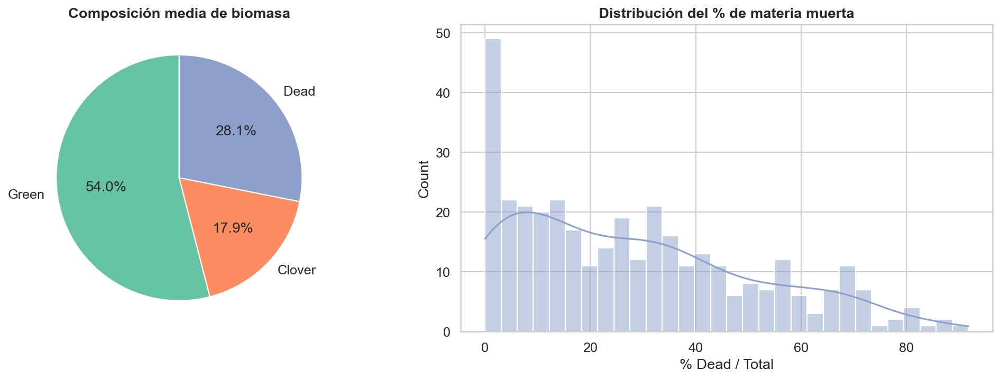

### 1.3 Variabilidad por estado

Los estados difieren **dramáticamente** (Kruskal-Wallis p < 1e-20 para los 3 targets):

| Estado | Green medio | Clover medio | Dead medio | Notas |
|--------|------------|-------------|-----------|-------|
| NSW | 56.56g | 0.13g | 14.20g | 98.7% de Clover = 0 |
| Tas | 15.33g | 6.24g | 15.23g | Distribución equilibrada |
| Vic | 25.45g | 7.11g | 10.11g | Distribución equilibrada |
| WA | 9.30g | 22.09g | **0.00g** | 100% Dead = 0, 50% Green = 0 |

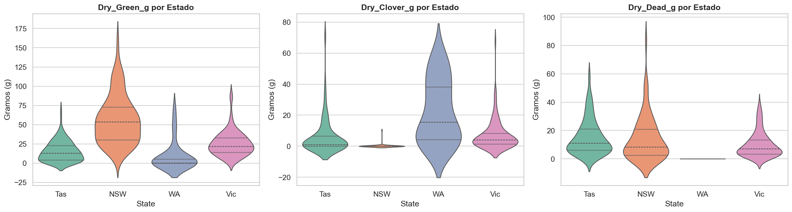

---

## 2. Decisión: Modelos Small/Tiny

### Justificación

Con 357 imágenes, el ratio datos/parámetros es críticamente bajo:

| Modelo | Params cabeza (hidden=128) | Ratio datos/params |
|--------|---------------------------|-------------------|
| ResNet50 | 262,659 | 0.001 |
| EfficientNet-B2 | 180,739 | 0.002 |
| ConvNeXt-Tiny | 98,819 | 0.003 |
| MaxViT-Tiny | 66,051 | 0.004 |
| ViT-Small | 49,667 | 0.006 |
| Swin-Tiny | 98,819 | 0.003 |

**Ninguna configuración alcanza ratio ≥ 1**, ni siquiera con hidden=32 (máximo: ViT-Small → 0.023).

Con cabeza directa (sin capa oculta), el mejor ratio es ViT-Small → 0.247 (1,155 params).

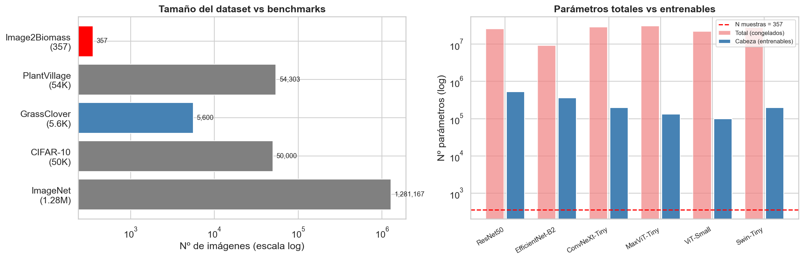

### Evidencia adicional (NB03)

- Top-5 configuraciones por ratio: todas son hidden=32 con backbones pequeños.
- Recomendación: experimentar con cabeza directa como baseline.

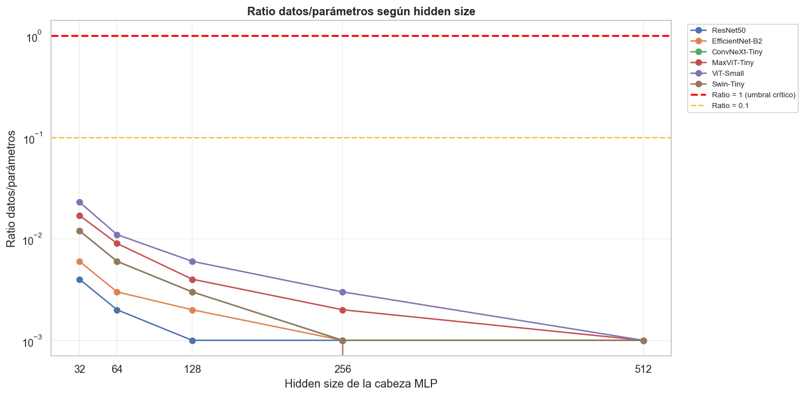

---

## 3. Decisión: Transformación log(1+y)

### Justificación

Los 3 targets tienen skewness positiva fuerte (1.75–2.84). La transformación log(1+y) reduce la magnitud absoluta del sesgo:

| Target | Skew raw | Skew log(1+y) | Skew sqrt(y) | Skew arcsinh(y) |
|--------|----------|--------------|-------------|----------------|
| Green | 1.751 | **-0.840** | 0.270 | -1.042 |
| Clover | 2.842 | **0.690** | 1.224 | 0.573 |
| Dead | 1.761 | **-0.426** | 0.308 | -0.624 |

**Observaciones críticas:**
- Green y Dead pasan a tener **sesgo negativo** (levo-sesgo) tras log.
- sqrt(y) produce menor |skewness| para Green (0.27) y Dead (0.31), pero mayor para Clover (1.22).
- arcsinh(y) correlaciona 0.998 con log(1+y) pero empeora Green (-1.04).
- Box-Cox óptima (λ = 0.11–0.33) excluye ceros — no es práctica.
- Shapiro-Wilk **rechaza normalidad** para los 3 targets incluso tras log (p < 0.05).
- Sin embargo, la log-transform **estabiliza la varianza** (heterocedasticidad) con pendientes 0.38–0.53 en la relación media-varianza.

**Veredicto:** log(1+y) es pragmática y suficiente. sqrt(y) merece un experimento de ablación.

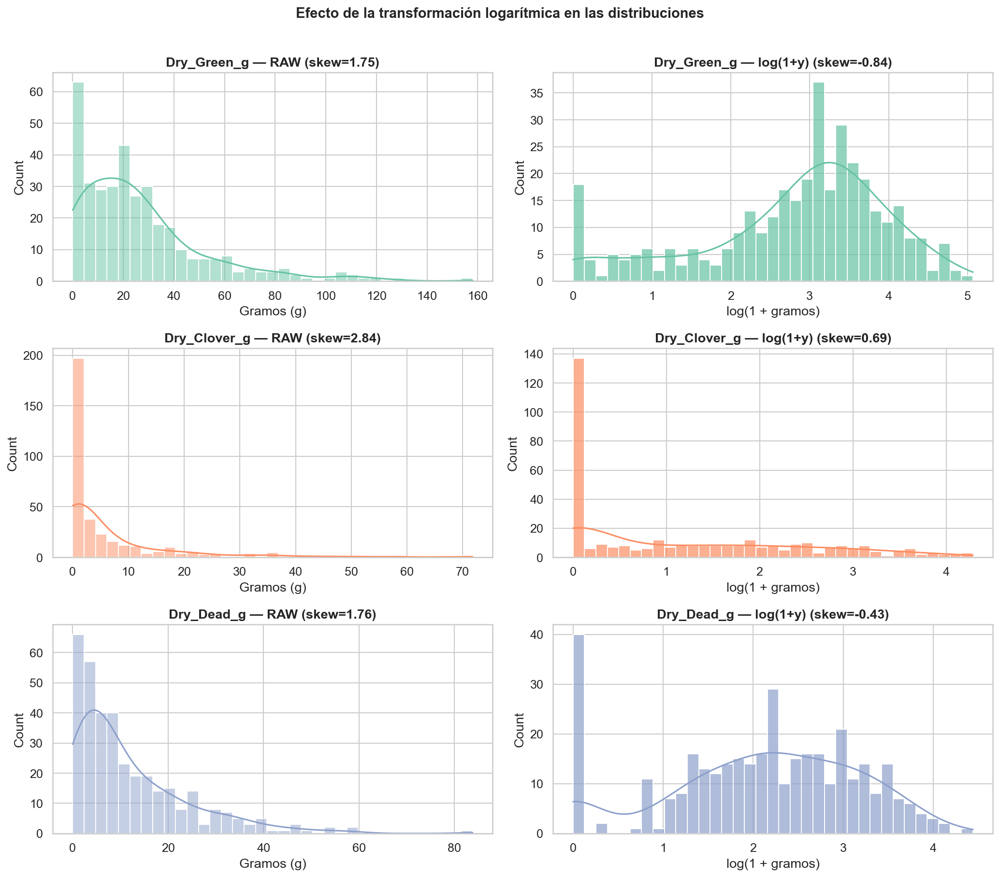
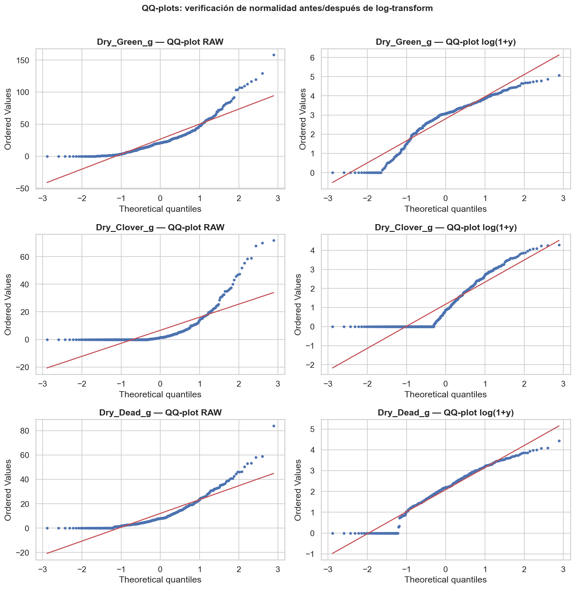
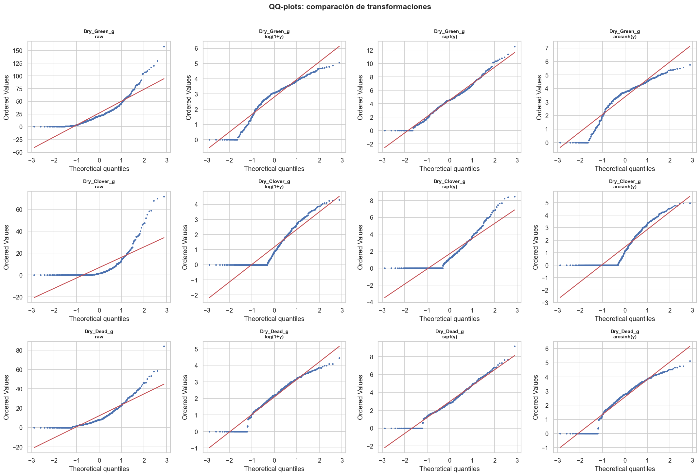

---

## 4. Decisión: Estandarización por Fold

### Justificación

Las escalas de los targets difieren hasta 4× (Green media=26.6g vs Clover=6.65g). Sin estandarización, Green dominaría MSE.

| Target | Media raw | Media log | Tras std (media ± std entre folds) |
|--------|-----------|-----------|-----------------------------------|
| Green | 26.62g | 2.81 | 0.00 ± 0.00 (train), -0.01 ± 0.53 (val) |
| Clover | 6.65g | 1.17 | 0.00 ± 0.00 (train), 0.00 ± 0.52 (val) |
| Dead | 12.04g | 2.09 | 0.00 ± 0.00 (train), 0.00 ± 0.27 (val) |

**Observación:** La varianza inter-fold en validación es NOTABLE para Green (val_std ± 0.36) y Clover (± 0.23), indicando que algunos folds son más difíciles. Dead es el más estable (± 0.15).

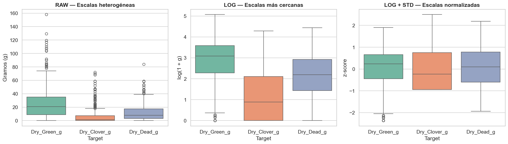
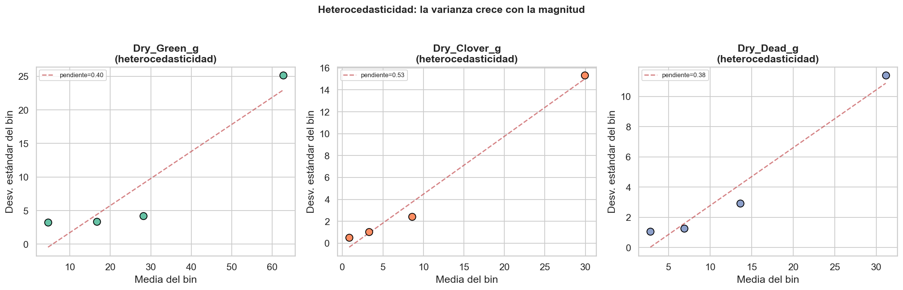

---

## 5. Decisión: 3 Targets Primarios → 2 Derivados

### Justificación

Las relaciones aditivas GDM = Green + Clover y Total = GDM + Dead se verificaron:
- Error GDM: máximo 0.0001g (despreciable)
- Error Total: máximo 0.3088g (1 fila anómala)

**Correlaciones entre targets:**
- GDM correlaciona 0.884 con Green (dominante) y solo 0.204 con Clover.
- Total correlaciona 0.896 con GDM y 0.454 con Dead.

Predecir los 3 primarios y derivar los compuestos garantiza coherencia física.

---

## 6. Decisión: Group K-Fold por Sampling_Date

### Justificación

- **0 overlap** de fechas entre train/val en cada fold → elimina leakage temporal.
- 28 fechas distribuidas en 5 folds (5–6 fechas/fold).

### Problema identificado: Desbalance de estados

| Fold | n_val | Estados presentes | Green medio | Clover medio | % Clover=0 |
|------|-------|-------------------|------------|-------------|-----------|
| 1 | 74 | Tas, Vic, WA | 16.66g | 9.45g | 17.6% |
| 2 | 68 | **NSW, Tas** | **42.00g** | **1.34g** | **73.5%** |
| 3 | 74 | NSW, Tas, Vic, WA | 20.07g | 11.53g | 27.0% |
| 4 | 73 | NSW, Tas, Vic, WA | 23.96g | 3.99g | 45.2% |
| 5 | 68 | NSW, Tas, Vic | 32.08g | 6.47g | 27.9% |

**Fold 2 es problemático:** solo NSW+Tas, Green 2.5× mayor que Fold 1, 73.5% de Clover son ceros. Esto producirá alta varianza en las métricas de validación.

**Recomendación:** Reportar R² por fold obligatoriamente. Considerar StratifiedGroupKFold por estado si está disponible.

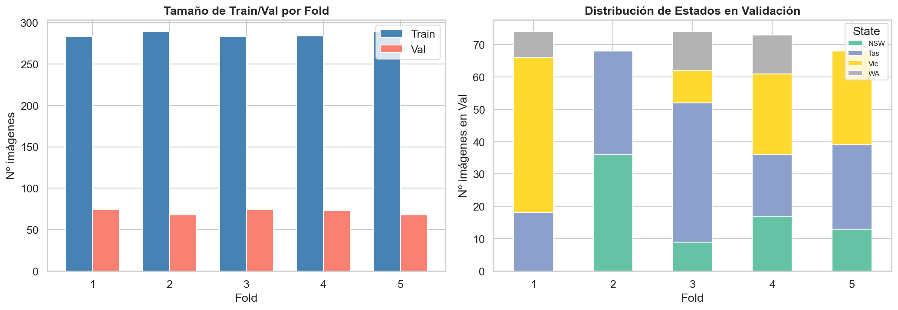
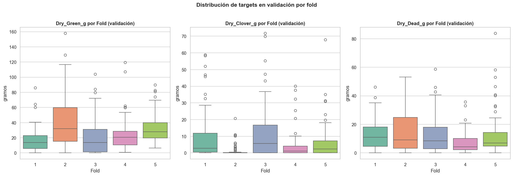

---

## 7. Decisión: MSE sin Ponderación

### Justificación

Tras log + estandarización, las 3 salidas tienen media ≈ 0 y std ≈ 1 en train. Las escalas son comparables y no se necesita ponderación diferencial.

La varianza inter-fold (Green: ±0.53, Clover: ±0.52, Dead: ±0.27) sugiere que algunos folds son inherentemente más difíciles, pero la media global es equilibrada.

---

## 8. Decisión: Backbone Congelado

### Justificación

| Modelo | Params congelados | Params cabeza | Factor reducción |
|--------|------------------|---------------|-----------------|
| ResNet50 | 25.6M | 525K | 49× |
| EfficientNet-B2 | 9.2M | 361K | 25× |
| ConvNeXt-Tiny | 28.6M | 198K | 145× |
| MaxViT-Tiny | 30.9M | 132K | 234× |
| ViT-Small | 22.1M | 99K | 222× |
| Swin-Tiny | 28.3M | 198K | 143× |

Descongelado, el ratio datos/params cae a ~0.00001 → overfitting garantizado. La reducción oscila entre 25× (EfficientNet) y 234× (MaxViT).

---

## 9. Decisión: Augmentations Ligeras

### Justificación

Con solo 357 imágenes, augmentations son esenciales. Se eligen transformaciones semánticamente válidas para pastos:

- **Horizontal flip (p=0.5):** La orientación del pasto no afecta biomasa.
- **Random rotation (±15°):** Simula variación del ángulo de captura.
- **Brightness/Contrast:** Simula diferencias de iluminación entre sitios y épocas.

Resolución original 2000×1000 → resize a 224×224 para los backbones.

---

## 10. Métrica de Evaluación: Weighted R²

### Pesos oficiales

| Target | Peso | Tipo | Acumulado |
|--------|------|------|-----------|
| Dry_Green_g | 0.1 | Primario | 0.1 |
| Dry_Dead_g | 0.1 | Primario | 0.2 |
| Dry_Clover_g | 0.1 | Primario | 0.3 |
| GDM_g | 0.2 | Derivado | 0.5 |
| Dry_Total_g | **0.5** | Derivado | 1.0 |

**Implicación clave:** Los derivados acumulan **70% del score**. Mejorar +0.1 R² en Total aporta +0.050, mientras que en cualquier primario solo +0.010.

Como Total = Green + Clover + Dead, mejorar los 3 primarios tiene impacto multiplicado.

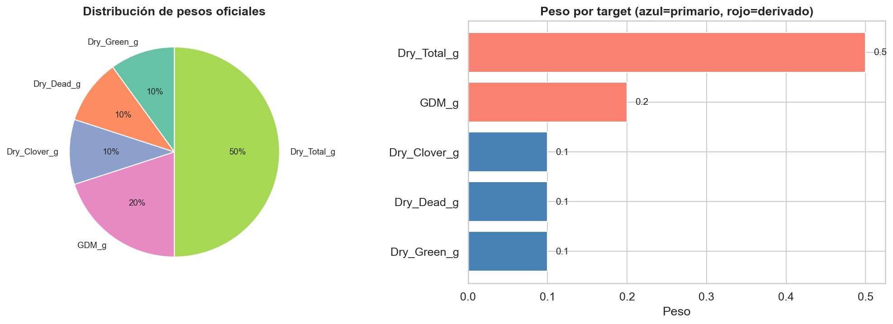

---

## 11. Zero-Inflation en Clover

### Hallazgo (NB03)

El 37.8% (135/357) de las imágenes tienen Clover = 0. El patrón es **geográfico**:
- NSW: 98.7% ceros (74/75 imágenes)
- Tas: 31.2% ceros
- Vic: 12.5% ceros
- WA: 12.5% ceros

Las muestras con Clover=0 tienen Green significativamente más alto (41.4g vs 17.7g) — son pastos SIN trébol, no campos vacíos.

Tras log+std, los 135 ceros se mapean a z = -0.94, creando un spike discreto.

**Riesgo:** La red podría aprender a predecir z ≈ -0.94 como "default" e ignorar variabilidad de Clover > 0.

**Mitigación:** Monitorizar R² de Clover por separado. Si es persistentemente bajo, considerar modelo two-stage (clasificar 0/no-0 + regresión).

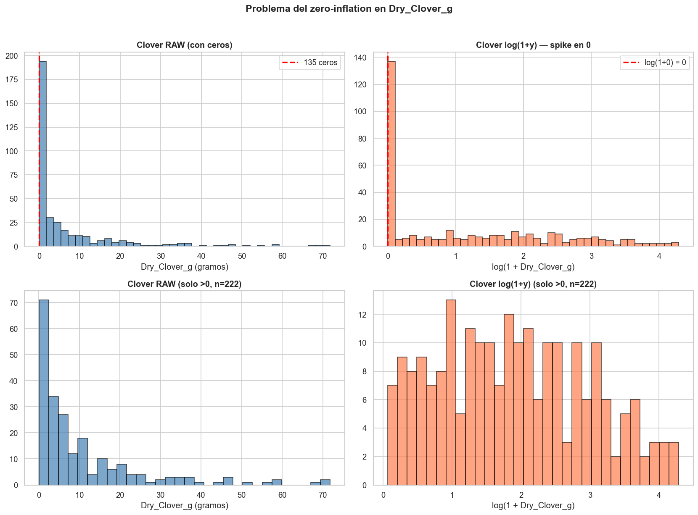

---

## 12. Outliers

### Hallazgo (NB03)

| Target | N outliers (IQR) | % | Límite superior | Media outlier | Max outlier |
|--------|-----------------|---|----------------|--------------|------------|
| Green | 20 | 5.6% | 74.5g | 100.4g | 158.0g |
| Clover | 41 | 11.5% | 18.1g | 34.9g | 71.8g |
| Dead | 14 | 3.9% | 39.3g | 50.3g | 83.8g |
| GDM | 16 | 4.5% | 85.2g | 108.6g | 158.0g |
| Total | 16 | 4.5% | 106.8g | 124.6g | 185.7g |

**Hallazgo clave:** El overlap entre outliers es **mínimo**: 0 imágenes son outlier en los 3 targets, solo 1 en Green+Dead. Los 74 outliers (20.7% del dataset) están distribuidos entre los 4 estados.

**Decisión:** No eliminar. La simulación muestra que removerlos no cambia el score (0.990 en ambos escenarios). La log-transform ya atenúa su magnitud.

---

## 13. Baseline con Variables Auxiliares

### Hallazgo (NB03)

NDVI y Height (disponibles solo en train) tienen poder predictivo notable:

| Auxiliar | vs Green | vs Clover | vs Dead |
|----------|---------|----------|---------|
| Height ρ (Spearman) | **+0.802*** | -0.454*** | +0.211*** |
| Height R² (lineal) | **0.421** | 0.026 | 0.003 |
| NDVI ρ (Spearman) | +0.449*** | +0.139** | -0.123* |
| NDVI R² (lineal) | 0.123 | 0.050 | 0.015 |
| Múltiple R² | **0.461** | 0.099 | 0.016 |

**Implicación:** NDVI+Height explican 46.1% de la varianza de Green. El modelo de imagen **debe superar** este R² = 0.46 en Green para justificar su complejidad. Para Clover (R² < 0.10) y Dead (R² < 0.02), la imagen es indispensable.

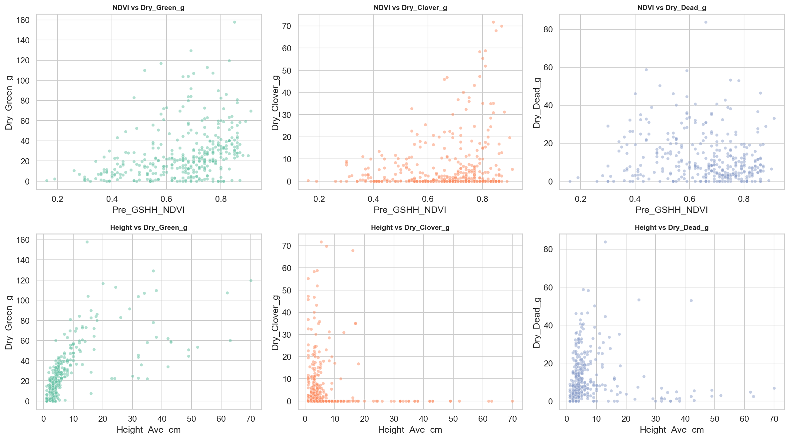

---

## 14. Configuración de Entrenamiento

| Parámetro | Valor | Justificación |
|-----------|-------|---------------|
| Seed | 42 | Reproducibilidad |
| Batch size | 16 | Compromiso memoria/gradientes con N=357 |
| Optimizer | Adam | Estándar para transfer learning |
| Learning rate | 1e-3 | Convergencia rápida para cabeza MLP |
| Epochs máx | 100 | Con early stopping |
| Early stopping | Paciencia 15 | Evitar overfitting con ratio datos/params <1 |
| Scheduler | ReduceLROnPlateau | Factor 0.5, paciencia 5 |
| Dropout | 0.3 | Regularización de la cabeza MLP |
| CV | 5-Fold GroupKFold | Grupo: Sampling_Date |

---

## 15. Protocolo de Análisis

### 15.1 Por cada modelo × fold reportar:
- Weighted R² (métrica primaria)
- R² por componente (5 targets)
- MAE y RMSE por componente
- Curvas de train/val loss

### 15.2 Comparación global:
- ANOVA o Kruskal-Wallis sobre Weighted R² (6 modelos × 5 folds)
- Post-hoc: Tukey HSD o Dunn test (α = 0.05)

### 15.3 Ablación mínima (mejor modelo):
1. Sin transformación log → impacto de raw targets
2. Sin estandarización → impacto del sesgo de escala
3. sqrt(y) en lugar de log(1+y) → mejor simetría para Green/Dead
4. Cabeza directa (sin hidden layer) → reducción drástica de params
5. Descongelar últimas capas → ver si ayuda pese al ratio < 1

---

## 16. Resumen de Decisiones Verificadas

| # | Decisión | Evidencia | Status |
|---|----------|-----------|--------|
| 1 | Modelos Small/Tiny | Ratio datos/params 0.001–0.006, ninguno ≥ 1 | ✓ Confirmada |
| 2 | log(1+y) | \|Skew\| 1.75–2.84 → 0.43–0.84; Green/Dead pasan a levo-sesgo; sqrt mejor para Green/Dead | ✓ Con matiz |
| 3 | Std por fold | Medias 6.6–26.6g → 0.0; varianza inter-fold notable en val (Green ± 0.53) | ✓ Confirmada |
| 4 | 3 primarios → 2 derivados | Coherencia física <0.31g error; GDM dominado por Green (r=0.884) | ✓ Confirmada |
| 5 | GroupKFold por fecha | 0 overlap temporal; Fold 2 problemático (NSW+Tas, 73.5% Clover=0) | ✓ Con riesgo |
| 6 | MSE sin ponderación | Escalas comparables post-std; varianza inter-fold aceptable | ✓ Confirmada |
| 7 | Backbone congelado | Factor reducción 25–234×; descongelado → ratio ~0.00001 | ✓ Confirmada |
| 8 | Augmentations ligeras | N=357, semánticamente válidas | ✓ Confirmada |
| 9 | Pesos oficiales | 70% score de derivados; mejorar Total aporta 5× más que un primario | ✓ Confirmada |

### Riesgos identificados
- **Zero-inflation en Clover** (37.8% ceros, concentrados en NSW): puede degradar R² de Clover.
- **Desbalance de estados entre folds**: Fold 2 (NSW+Tas) es fundamentalmente distinto al resto.
- **Baseline tabular fuerte para Green**: NDVI+Height explican 46.1% — el modelo visual debe superar esto.
- **Ratio datos/params siempre < 1**: Early stopping y dropout son imprescindibles.
